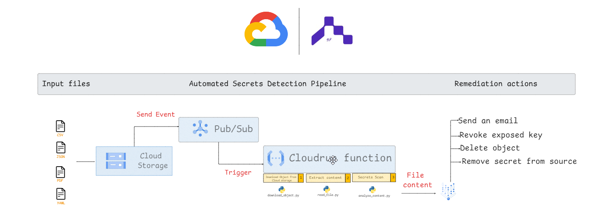

# Automated Secrets Detection Pipeline (GCP Bootcamp Project)

This project was developed as part of the **Tuwaiq Academy | Google Cloud Bootcamp**.  
The goal is to automatically detect leaked secrets (like passwords or API keys) inside uploaded files stored in **Google Cloud Storage**.

---

## 📌 How it works
1. **Upload a file** (CSV, JSON, PDF, YAML) to **Cloud Storage**.
2. A **Pub/Sub event** is triggered.
3. A **Cloud Function** is executed:
   - Downloads the file.
   - Extracts its content.
   - Scans for possible secrets (e.g., hardcoded passwords, keys).
4. **Results** are produced as JSON output.

---

## 🖼️ Architecture


---
## 🔍 Example

### Sample Input
```json
{
  "has_secrets": true,
  "findings": [
    {
      "type": "password",
      "name": "Password",
      "masked_value": "****@123",
      "match_excerpt": "\"password\": \"****@123\"",
      "line": 3,
      "confidence": 1,
      "reasoning": "The field is explicitly named 'password' and contains a string value."
    }
  ],
  "summary": {
    "count": 1,
    "suggested_actions": [
      "Revoke and rotate any exposed keys",
      "Remove secrets from source; use a secrets manager",
      "Add automated scanning to CI/CD"
    ]
  }
}
```

## ⚠️ Current Status

- ✅ Secrets detection pipeline working.
- 🚧 **Remediation actions (e.g., delete object, revoke key, send alerts) are not implemented yet.**